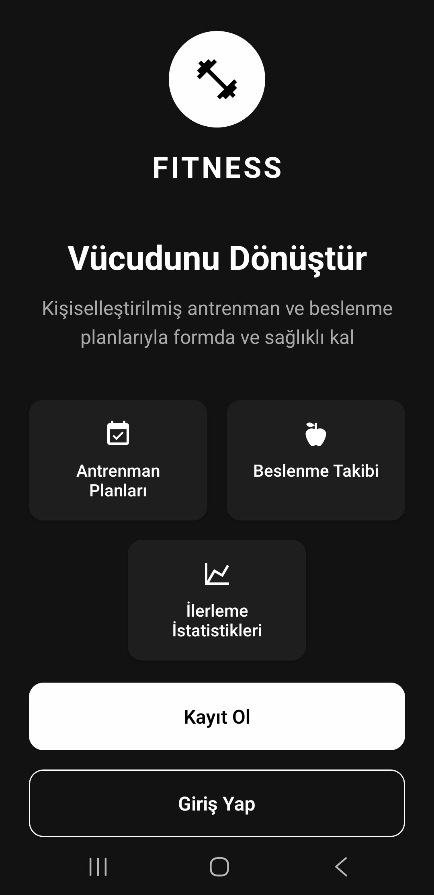
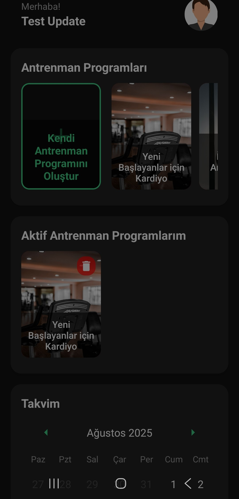
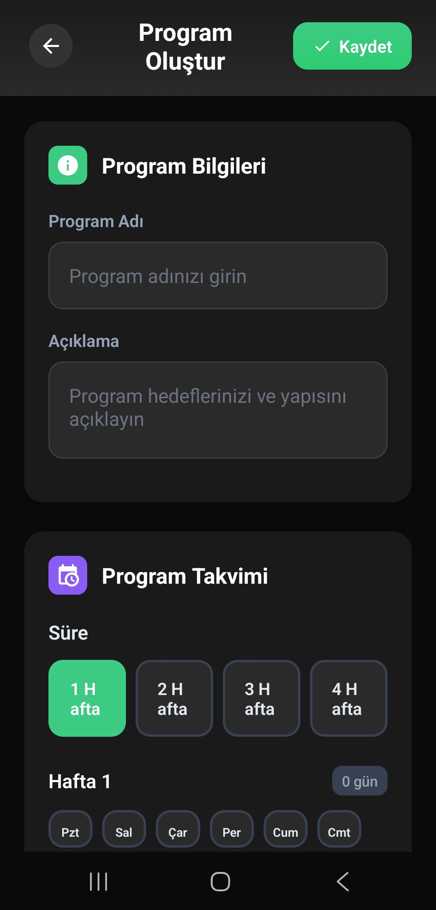
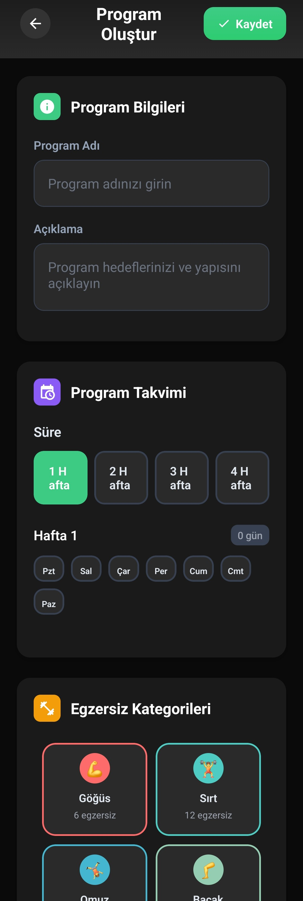
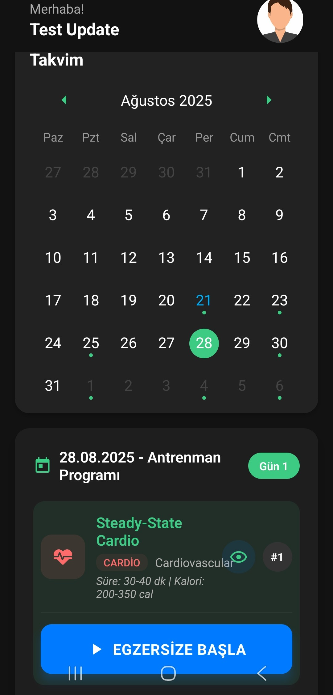
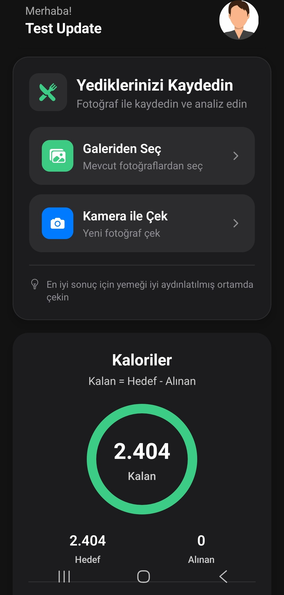
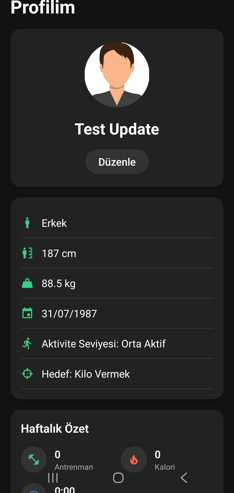
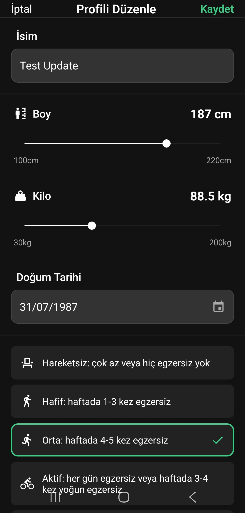

# Fitness App Frontend

Bu proje, Expo ve React Native kullanılarak geliştirilmiş bir mobil fitness uygulamasıdır. Kullanıcıların antrenman programları oluşturmasına, ilerlemelerini takip etmesine ve kişisel profillerini yönetmesine olanak tanır.

## Proje Yapısı

Proje, Expo'nun standart dosya tabanlı yönlendirme (file-based routing) yapısını kullanır. Ana dizinler ve dosyalar şunlardır:

- **app/**: Uygulamanın ekranlarını ve yönlendirme mantığını içerir.
- **assets/**: Uygulamada kullanılan resimler, ikonlar gibi statik dosyaları barındırır.
- **components/**: Uygulama genelinde tekrar kullanılabilir bileşenleri içerir (örneğin, butonlar, giriş alanları).
- **constants/**: Renkler, yazı tipleri gibi sabit değerleri tanımlar.
- **hooks/**: Özel React hook'larını içerir.

## Ekranlar ve İşlevler

Uygulama, kullanıcıların fitness hedeflerine ulaşmalarını kolaylaştırmak için çeşitli ekranlar ve işlevler sunar.

### Karşılama Ekranı
Uygulama ilk açıldığında kullanıcıyı karşılayan ekrandır. Giriş yapma ve kayıt olma seçenekleri sunar.



### Ana Ekran
Kullanıcının giriş yaptıktan sonra gördüğü ana ekrandır. Oluşturulan programlar, günlük hedefler ve genel ilerleme durumu burada görüntülenir.



### Program Oluşturma
Kullanıcıların kendi antrenman programlarını oluşturabildikleri ekrandır. Egzersiz seçimi, set ve tekrar sayıları gibi detaylar burada belirlenir.



Program oluşturma ekranında daha fazla detay ve egzersiz ekleme seçenekleri de mevcuttur.



### Antrenman Ekranı
Aktif bir antrenman sırasında kullanılan ekrandır. Egzersizler, zamanlayıcı ve set takibi gibi işlevleri içerir.



### Yapay Zeka Desteği
Uygulama, kullanıcıların programlarını optimize etmelerine yardımcı olmak için yapay zeka destekli öneriler sunar.



### Profil Ekranı
Kullanıcının kişisel bilgilerini, istatistiklerini ve başarılarını görüntülediği ekrandır.



### Profili Düzenleme
Kullanıcılar bu ekrandan kişisel bilgilerini (boy, kilo, yaş vb.) güncelleyebilirler.



## İletişim
Herhangi bir hata durumunda [Gurkahramann](https://github.com/Gurkahramann) ile iletişime geçebilirsiniz. 
## Get started

1. Install dependencies

   ```bash
   npm install
   ```

2. Start the app

   ```bash
   npx expo start
   ```

In the output, you'll find options to open the app in a

- [development build](https://docs.expo.dev/develop/development-builds/introduction/)
- [Android emulator](https://docs.expo.dev/workflow/android-studio-emulator/)
- [iOS simulator](https://docs.expo.dev/workflow/ios-simulator/)
- [Expo Go](https://expo.dev/go), a limited sandbox for trying out app development with Expo

You can start developing by editing the files inside the **app** directory. This project uses [file-based routing](https://docs.expo.dev/router/introduction).

## Learn more

To learn more about developing your project with Expo, look at the following resources:

- [Expo documentation](https://docs.expo.dev/): Learn fundamentals, or go into advanced topics with our [guides](https://docs.expo.dev/guides).
- [Learn Expo tutorial](https://docs.expo.dev/tutorial/introduction/): Follow a step-by-step tutorial where you'll create a project that runs on Android, iOS, and the web.

## Join the community

Join our community of developers creating universal apps.

- [Expo on GitHub](https://github.com/expo/expo): View our open source platform and contribute.
- [Discord community](https://chat.expo.dev): Chat with Expo users and ask questions.
